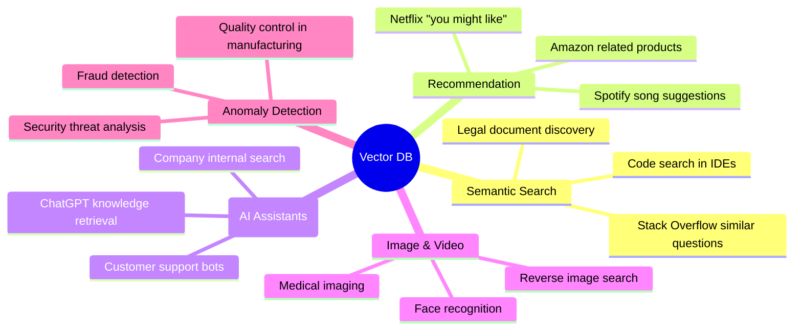
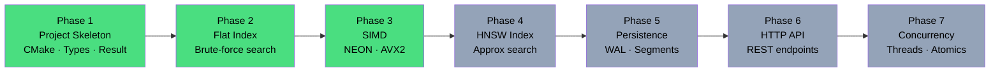
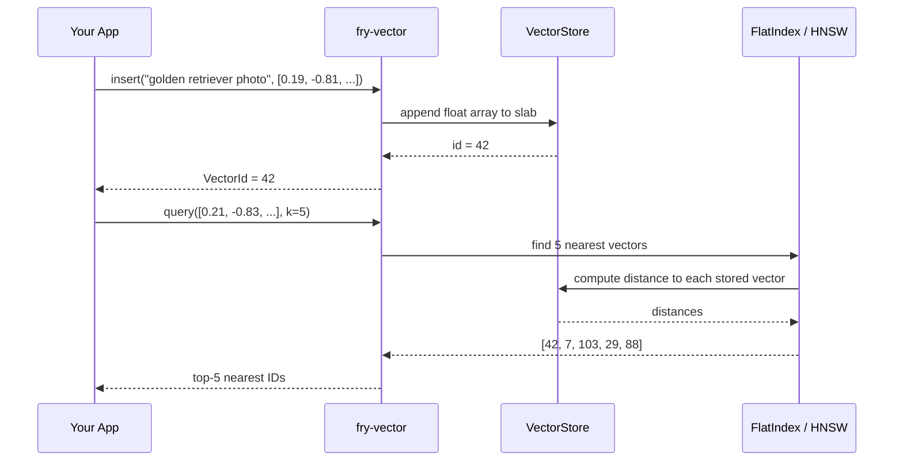

# What is a Vector Database, and why build one ?

> **Series:** Building `fry-vector` — A Vector Database from Scratch in C++11  
> **Level:** Layman → Intermediate  
> **Audience:** Anyone curious about how AI search engines work under the hood  


## The Problem: Searching for *Meaning*, Not Keywords

Imagine you type "a dog running on a beach" into a photo app. A traditional database would search for photos literally tagged with those exact words. A vector database finds photos that *look like* a dog running on a beach — even if none of them have that exact tag.

How? By turning everything — text, images, audio, video — into a list of numbers called a **vector**, and then finding vectors that are *close* to each other in mathematical space.

```
"a dog running on a beach"  →  [0.21, -0.83, 0.44, 0.12, ...]  (1536 numbers)
"golden retriever at ocean" →  [0.19, -0.81, 0.47, 0.10, ...]  (1536 numbers)
"cat sitting indoors"       →  [-0.54, 0.32, -0.11, 0.77, ...]  (1536 numbers)
```

The dog and beach vector is *close* to the golden retriever vector. The cat vector is *far away*. A vector database finds the closest ones fast — even when you have billions of them.


## Where Vector Databases Are Used Today



Every time a large language model (LLM) like Claude "remembers" something from a document you shared, it's using vector search to find the relevant chunks of that document. This pattern is called **RAG — Retrieval-Augmented Generation**.


## What Makes It Different from a Regular Database

| Question | Regular DB (PostgreSQL) | Vector DB (fry-vector) |
|---|---|---|
| Query type | "Find rows WHERE name = 'Alice'" | "Find vectors *nearest* to this query vector" |
| Data model | Tables, rows, columns | High-dimensional float arrays |
| Matching | Exact match or range | Approximate similarity |
| Index type | B-Tree, hash index | HNSW graph, Flat index |
| Use case | Structured business data | Embeddings, AI outputs |


## The Journey: Seven Phases

`fry-vector` is built in seven phases, from zero to a production-ready system:



*Green = complete. Grey = upcoming.*

Phases 1–3 are done. We have: a type-safe C++11 foundation, brute-force search across any metric, and SIMD-accelerated distance functions for both ARM (NEON) and x86 (AVX2).


## The Core Idea in One Diagram



That's the whole system in one picture. The rest of these blogs explain how each piece works.


## What You'll Learn in This Series

Each blog in this series covers one phase of the implementation and explains:

1. **The concept** — what problem it solves and why it's designed the way it is
2. **The math** — the equations behind distance functions, heap algorithms, and graph search
3. **The C++ implementation** — real code from `fry-vector` with line-by-line explanation
4. **The C++11 gotchas** — things that would be easy in C++17/20/23 but require manual work in C++11

| Blog | Topic | Key Concept |
|---|---|---|
| 1 (this one) | Introduction | What is a vector database? |
| 2 | Core Types | `Vector<T>`, `Result<T>`, `VectorStore` |
| 3 | Distance Metrics | L2, Cosine, Inner Product |
| 4 | FlatIndex | Brute-force top-K with a max-heap |
| 5 | SIMD | ARM NEON and x86 AVX2 acceleration |

---

## Up Next

[**Blog 2 →**](./02-core-types.md) — We build the foundation: a type-safe `Vector<T>`, a hand-rolled `Result<T>` error type (C++11's answer to `std::expected`), and the flat memory slab that stores all vectors.

---

*Built with C++11 · CMake · Catch2 · clang-tidy · ASan*
*Source: [github.com/anuragambuj/fry-vector](https://github.com/anuragambuj/fry-vector)*
