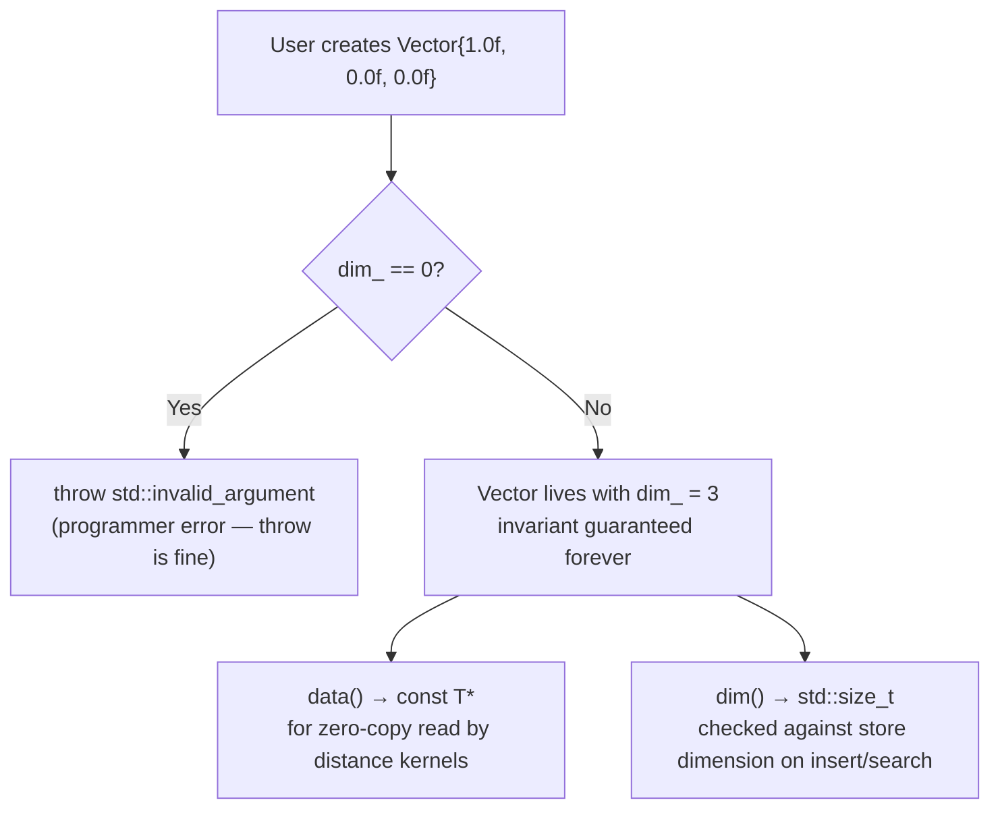
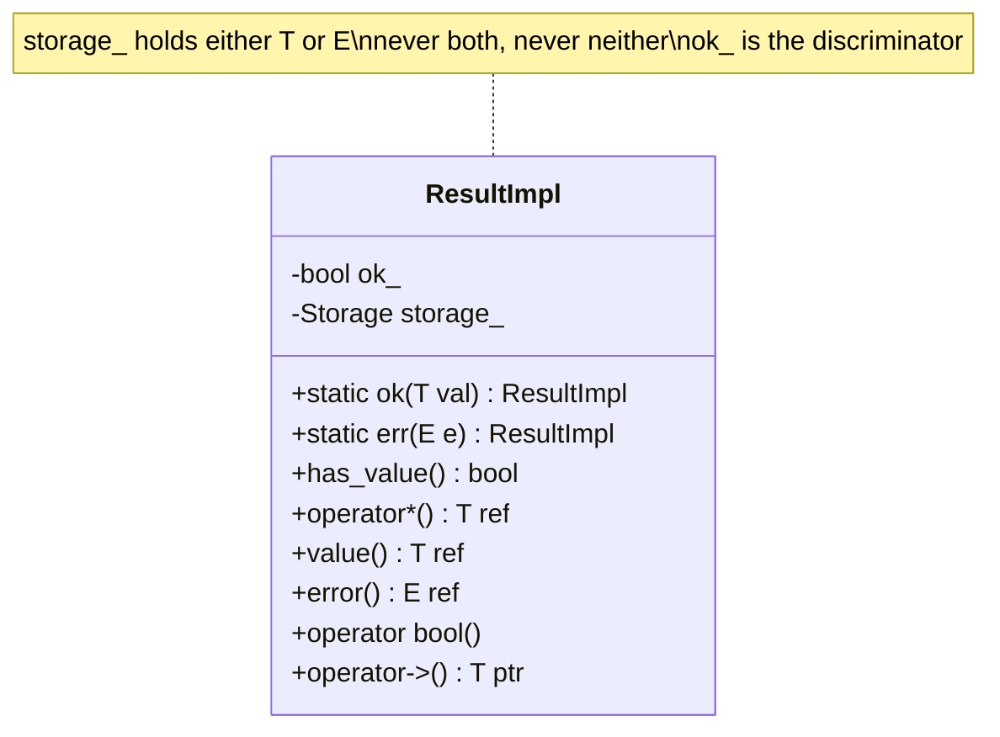
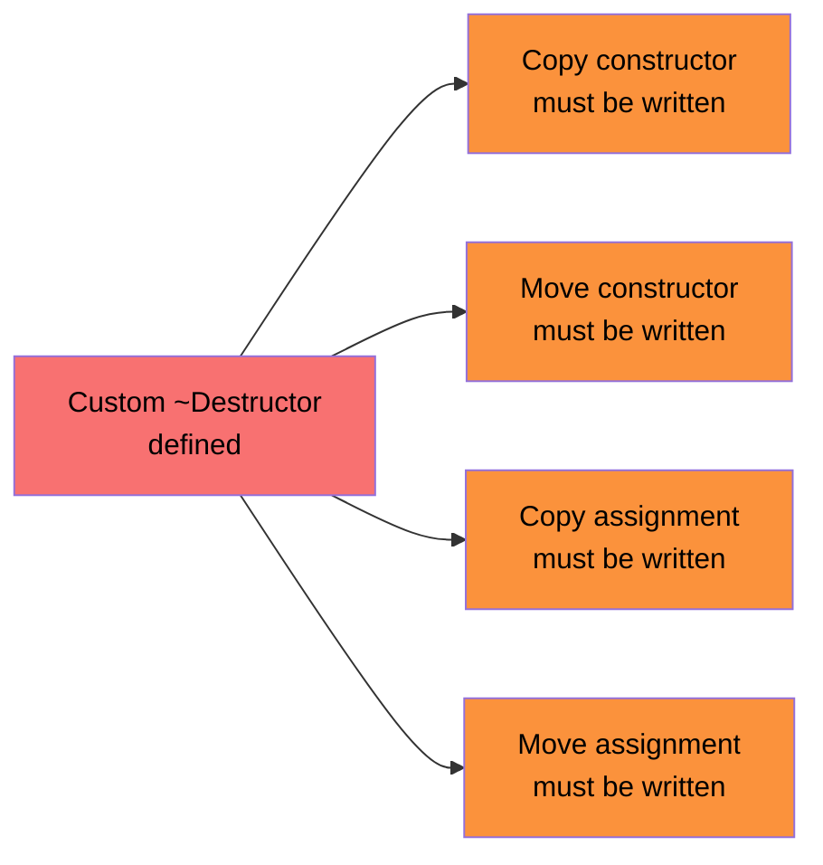
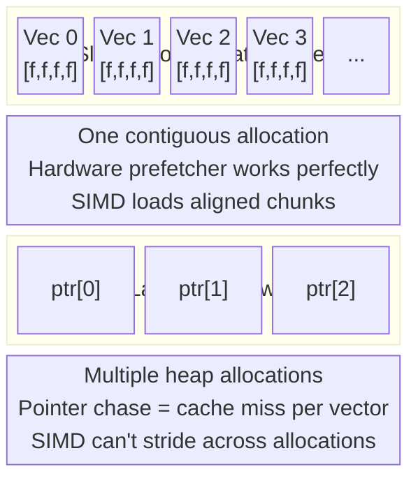
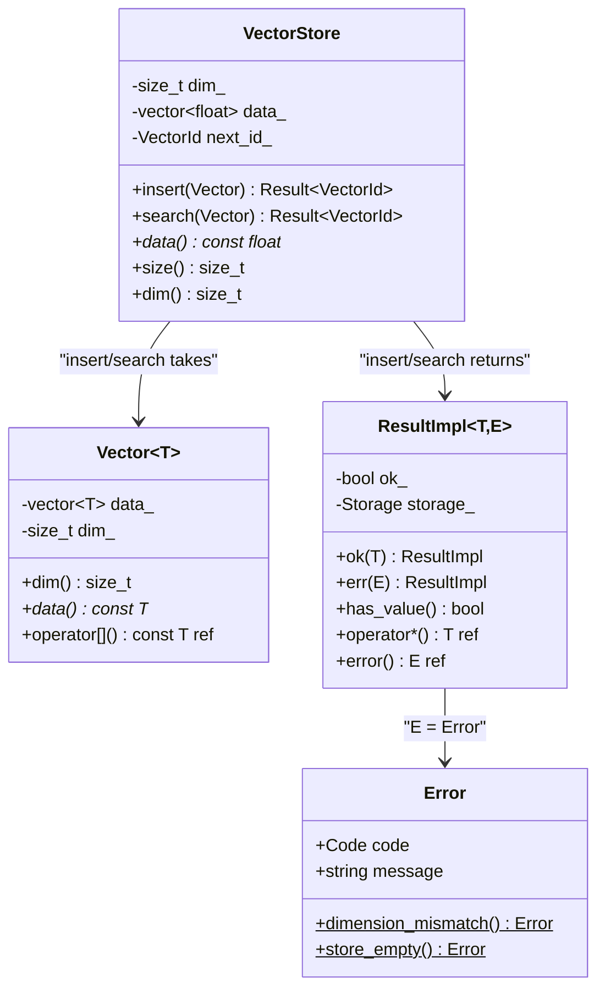

# Blog 2 — Core Types: `Vector<T>`, `Result<T>`, and `VectorStore`

> **Series:** Building `fry-vector` — A Vector Database from Scratch in C++11
> **Level:** Intermediate
> **Files:** `include/fry/types.hpp`, `include/fry/result.hpp`, `include/fry/vector_store.h`, `src/vector_store.cpp`

---

## The Foundation Problem

Before we can search for anything, we need safe, efficient building blocks. Three design decisions shape everything else in `fry-vector`:

1. **How do we represent a vector?** Raw `float*`? `std::vector<float>`? Something else?
2. **How do we report errors without exceptions?** Search runs millions of times per second — exception handling is too expensive on the hot path.
3. **How do we store millions of vectors in memory efficiently?** Each byte of wasted layout multiplies by a million.

This blog answers all three.

---

## Part 1 — `Vector<T>`: A Dimension-Aware Float Array

### The Naive Approach and Its Problem

You might reach for `std::vector<float>` directly:

```cpp
std::vector<float> query = {1.0f, 0.0f, 0.0f};
std::vector<float> stored = {1.0f, 0.0f};  // different dimension!
float dist = l2_distance(query, stored);    // silent wrong answer
```

A plain `std::vector<float>` carries no dimension information. Mismatches are only caught *deep inside a distance loop*, producing wrong answers with no error.

### The Solution: Encode Dimension at Construction

```cpp
// include/fry/types.hpp
template <typename T = float>
class Vector {
public:
    Vector(std::initializer_list<T> elems)
        : data_(elems), dim_(data_.size()) {
        if (dim_ == 0)
            throw std::invalid_argument("fry::Vector: dimension must be > 0");
    }

    explicit Vector(std::vector<T> data)
        : data_(std::move(data)), dim_(data_.size()) {
        if (dim_ == 0)
            throw std::invalid_argument("fry::Vector: dimension must be > 0");
    }

    std::size_t dim()   const { return dim_; }
    const T*    data()  const { return data_.data(); }
    const T&    operator[](std::size_t i) const { return data_[i]; }

private:
    std::vector<T> data_;
    std::size_t    dim_;
};
```

Now dimension is an invariant — it's impossible to create a zero-dimension vector, and the dimension is always known without separately tracking it.

### Key Design Decisions



**Why `const T* data()`?** Distance functions (and SIMD kernels) need a raw pointer for pointer arithmetic. Returning `const T*` gives read-only access without copying the data.

**Why templated on `T`?** Today we use `float`. In a future phase, `uint8_t` (quantised 8-bit vectors) could store 4× more vectors in the same RAM.

**C++11 gotcha — CTAD doesn't exist yet:**

```cpp
// C++17: works — compiler deduces Vector<float>
Vector v{1.0f, 0.0f, 0.0f};

// C++11: must be explicit
Vector<float> v{1.0f, 0.0f, 0.0f};
```

---

## Part 2 — `Result<T>`: Error Handling Without Exceptions

### Why Not Exceptions on the Hot Path?

A search function called 1 million times per second cannot afford exceptions. When `std::throw` is triggered, the runtime unwinds the call stack frame by frame — this is expensive even once, catastrophic at high frequency.

The C++23 standard library has `std::expected<T, E>` for this pattern. We're on C++11, so we build it ourselves.

### The Discriminated Union

`ResultImpl<T, E>` holds **either** a value of type `T` **or** an error of type `E` — never both, never neither. This is sometimes called a *discriminated union* or a *sum type*.



### The Memory Layout

```
┌─────────┬────────────────────────────────────────────────────┐
│  ok_    │              storage_                              │
│  bool   │  max(sizeof(T), sizeof(E)) bytes                  │
│  1 byte │  correctly aligned for both T and E               │
└─────────┴────────────────────────────────────────────────────┘

ok_ == true  → storage_ contains a live T object
ok_ == false → storage_ contains a live E object
```

The key C++11 mechanism that makes this work is `std::aligned_storage`:

```cpp
static const std::size_t kSize  = sizeof(T)  > sizeof(E)  ? sizeof(T)  : sizeof(E);
static const std::size_t kAlign = alignof(T) > alignof(E) ? alignof(T) : alignof(E);

typedef typename std::aligned_storage<kSize, kAlign>::type Storage;
Storage storage_;
```

`std::aligned_storage` gives us a raw byte buffer of the right size and alignment — think of it as a parking space sized for the largest car that might park there.

### Placement New: Constructing Without Allocating

Normal `new` allocates memory AND calls a constructor. We don't want to allocate — the buffer is already part of our object. We just want to call the constructor at a specific address:

```cpp
// Construct T inside our buffer — no allocation, just constructor call
new (&storage_) T(std::move(val));

// Later, to destroy it explicitly:
reinterpret_cast<T*>(&storage_)->~T();
```

This is called **placement new**. It's the same mechanism used internally by `std::vector`, `std::optional`, `std::any`, and `std::variant` in every standard library implementation.

### The Rule of Five

Whenever you write a custom destructor, the compiler stops generating copy/move operations. You must write all five yourself:



If you skip this, the compiler generates a **bitwise copy** of `storage_` — which duplicates the bytes without calling `T`'s copy constructor. For any `T` that owns resources (like `std::string`), this is silent undefined behaviour: two objects think they own the same memory, and both will try to free it.

### Using `Result<T>` at Call Sites

```cpp
// Returning success
auto insert(...) -> Result<VectorId> {
    return make_ok(next_id_++);
}

// Returning an error
auto insert(const Vector<float>& vec) -> Result<VectorId> {
    if (vec.dim() != dim_)
        return make_error<VectorId>(Error::dimension_mismatch(vec.dim(), dim_));
    // ...
}

// Consuming a Result
Result<VectorId> r = store.insert(vec);
if (r) {
    std::cout << "inserted id=" << *r << "\n";
} else {
    std::cerr << "error: " << r.error().message << "\n";
}
```

The `Error` type carries a machine-readable `Code` enum and a human-readable `message` string:

```cpp
struct Error {
    enum class Code : uint8_t {
        Ok, DimensionMismatch, NotFound, StoreEmpty, InvalidArgument, IoError
    };
    Code        code;
    std::string message;
};
```

---

## Part 3 — `VectorStore`: The Memory Slab

### Storage Layout: Why Contiguous?

The most important performance decision for a vector database is memory layout. `VectorStore` stores all vectors in a single flat `std::vector<float>`:

```
data_  (one big array):
┌─────────────────┬─────────────────┬─────────────────┬─────┐
│  vector 0       │  vector 1       │  vector 2       │ ... │
│  [f0,f1,f2,f3]  │  [f0,f1,f2,f3]  │  [f0,f1,f2,f3]  │     │
└─────────────────┴─────────────────┴─────────────────┴─────┘
   offset 0          offset dim_       offset 2*dim_
```

**Vector `i` lives at: `data_ + i * dim_`**

This "slab" layout has a critical advantage: when we scan all vectors during brute-force search, we read memory sequentially. Modern CPUs prefetch sequential memory automatically — the hardware fetches the next cache line before we even ask for it.

### The Alternative: Pointer-per-Vector

```
// What NOT to do:
std::vector<float*> vectors;  // one heap allocation per vector
vectors[0] → [f0, f1, f2, f3]  // pointer chase for every vector
vectors[1] → [f0, f1, f2, f3]  // pointer chase for every vector
```

With a pointer-per-vector layout, accessing vector `i` requires dereferencing a pointer. Each dereference is a potential cache miss. At 1M vectors, this is millions of cache misses per query — 10–100× slower.



### Insert and ID Assignment

```cpp
auto VectorStore::insert(const Vector<float>& vec) -> Result<VectorId> {
    if (vec.dim() != dim_)
        return make_error<VectorId>(Error::dimension_mismatch(vec.dim(), dim_));

    // Append the vector's floats to the end of the slab
    data_.insert(data_.end(), vec.data(), vec.data() + dim_);

    return make_ok(next_id_++);  // Stable, monotonically increasing ID
}
```

IDs are sequential integers starting from 0. The ID of a vector is also its position in the slab: vector with ID `i` is at `data_ + i * dim_`. No separate ID-to-offset map is needed.

### The Full Architecture



---

## Summary

| Component | What it solves | Key C++11 technique |
|---|---|---|
| `Vector<T>` | Dimension-safe float array | Class templates, `initializer_list`, ownership |
| `ResultImpl<T,E>` | Error handling without exceptions | `aligned_storage`, placement new, Rule of Five |
| `VectorStore` | Fast sequential storage for millions of vectors | Contiguous slab layout, sequential IDs |

The invariants established here — every `Vector` has a known dimension, every operation returns a `Result`, all vectors live in one flat array — make everything that follows simpler and faster.

---

[**← Blog 1**](./01-what-is-a-vector-database.md) · [**Blog 3 →**](./03-distance-metrics.md)

*Built with C++11 · CMake · Catch2 · clang-tidy · ASan*
