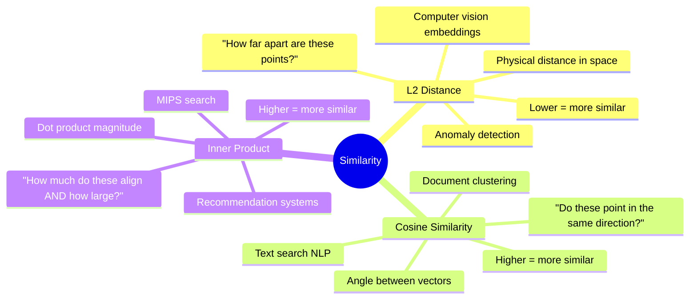
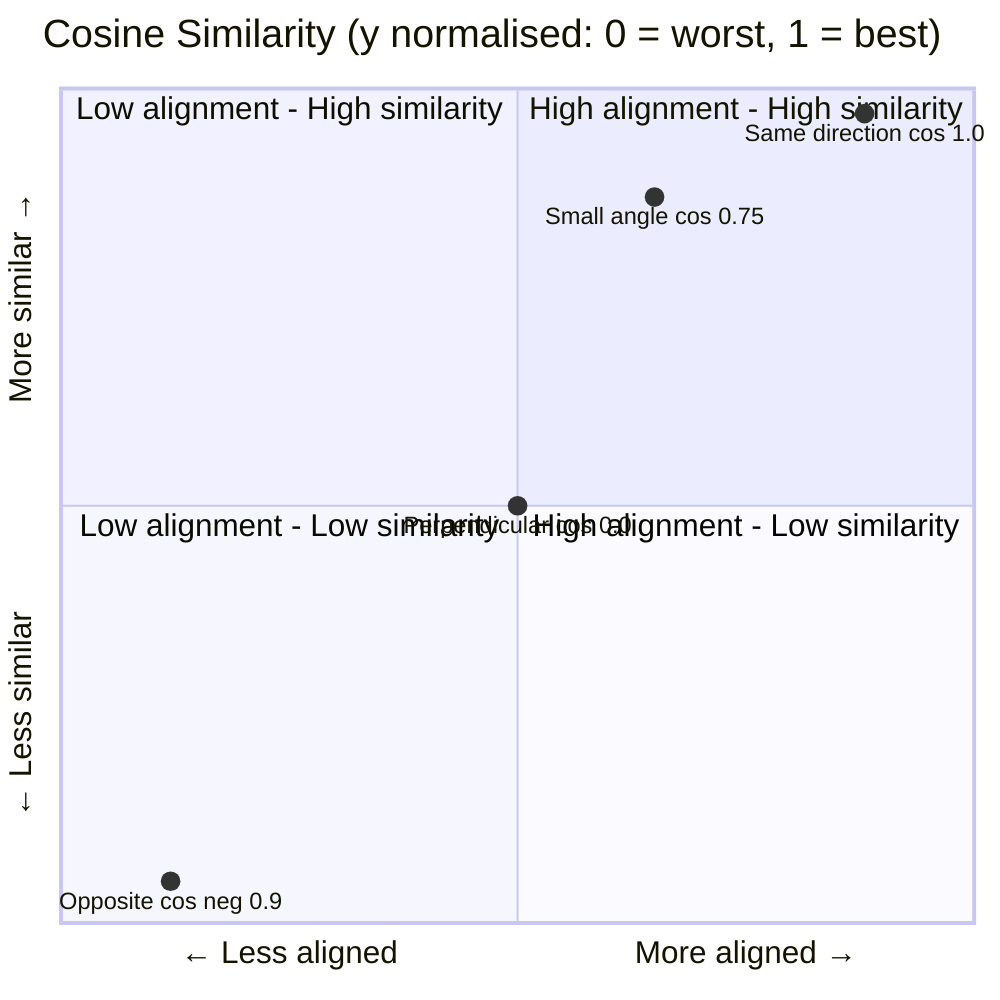
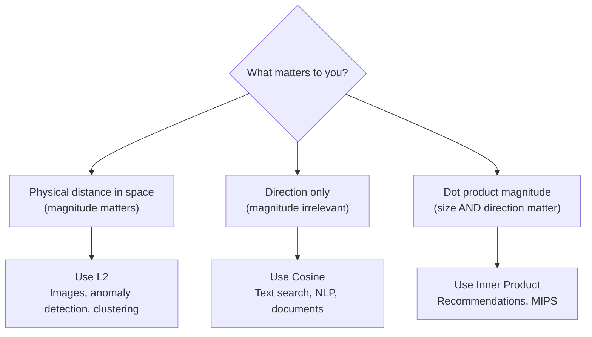
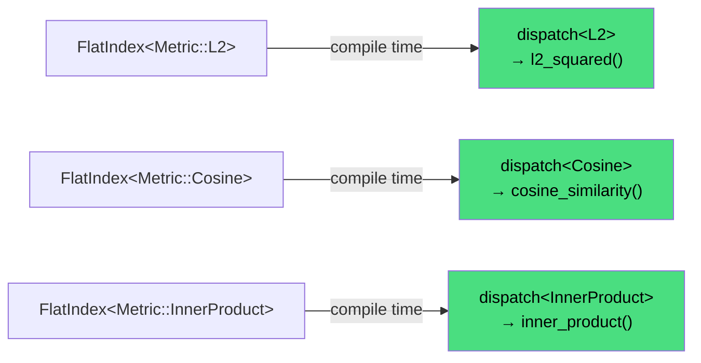

# Blog 3 — Distance Metrics: L2, Cosine, and Inner Product

> **Series:** Building `fry-vector` — A Vector Database from Scratch in C++11  
> **Level:** Intermediate (math-friendly)  
> **File:** `include/fry/distance.hpp`  

## The Central Question: What Does "Similar" Mean?

Once you have millions of vectors, the core operation is always the same: **given a query vector, which stored vectors are most similar?**

But "similar" is not one thing. Depending on your use case, you need a different definition of closeness. `fry-vector` supports three:



## Metric 1 — L2 (Euclidean) Distance

### The Math

L2 distance is the straight-line distance between two points. For two vectors **a** and **b** with `dim` dimensions:

```
L2(a, b) = √ Σᵢ (aᵢ - bᵢ)²
```

We store the **squared** L2 distance — no `√` needed. For nearest-neighbour comparison, if `L2(a,q)² < L2(b,q)²`, then `L2(a,q) < L2(b,q)`. The ordering is preserved. Skipping `sqrt` saves one expensive transcendental function call per comparison.

```
a = [1, 2, 3]
b = [4, 6, 3]

differences:  [1-4, 2-6, 3-3] = [-3, -4, 0]
squared:      [9, 16, 0]
sum:          25
L2²(a,b) = 25     (L2 = 5.0)
```

### The Code

```cpp
inline auto l2_squared(const float* a, const float* b, const std::size_t dim) -> float {
    float squared = 0.0f;
    for (std::size_t i = 0; i < dim; ++i) {
        squared = squared + ((a[i] - b[i]) * (a[i] - b[i]));
    }
    return squared;
}
```

### When to Use L2

L2 works when the **magnitude** of the vector matters as much as its direction. An image embedding of a bright red car and a dim red car would differ in magnitude — L2 captures that they're somewhat different. Use L2 for:

- Image similarity (pixel or embedding space)
- Anomaly detection (how far from normal?)
- Clustering (k-means uses L2)

---

## Metric 2 — Cosine Similarity

### The Math

Cosine similarity measures the **angle** between two vectors, ignoring their lengths. Two vectors pointing in the exact same direction have cosine similarity 1.0 (regardless of how long they are). Opposite directions give -1.0. Perpendicular gives 0.0.

```
cosine(a, b) = (a · b) / (|a| × |b|)

where:
  a · b = Σᵢ aᵢ × bᵢ    (inner product)
  |a|   = √(Σᵢ aᵢ²)     (vector magnitude / norm)
```

```
a = [1, 0, 0]    (points along x-axis)
b = [5, 0, 0]    (also points along x-axis, but longer)

a · b = 5
|a| = 1,  |b| = 5
cosine(a, b) = 5 / (1 × 5) = 1.0    (identical direction)
```



### The Code

```cpp
inline auto norm(const float* arr, const std::size_t dim) -> float {
    float n = 0.0f;
    for (std::size_t i = 0; i < dim; ++i)
        n += arr[i] * arr[i];
    return std::sqrt(n);
}

inline auto cosine_similarity(const float* a, const float* b, std::size_t dim) -> float {
    float const norm_product = norm(a, dim) * norm(b, dim);
    if (norm_product == 0.0f) return 0.0f;   // guard: zero-length vector
    return inner_product(a, b, dim) / norm_product;
}
```

**The zero-guard is critical.** If either vector is all zeros, `norm = 0`, and we'd divide by zero. We return 0.0 instead (no similarity with a zero vector).

**Bug we caught:** An early version had `norm(a,dim) + norm(b,dim)` instead of `*`. Addition gives a completely wrong denominator — it would never equal zero (so the guard never triggers correctly either), and the resulting "similarity" value is mathematically meaningless.

### When to Use Cosine

Cosine ignores magnitude, which is powerful for text. The sentences "I love dogs" and "I REALLY LOVE DOGS" have different word counts (different vector magnitudes) but very similar meaning (same direction). Use cosine for:

- Semantic text search
- Document deduplication
- Anything where normalized magnitude doesn't matter

---

## Metric 3 — Inner Product

### The Math

The inner product (also called dot product) is simply the sum of elementwise products:

```
a · b = Σᵢ aᵢ × bᵢ
```

Unlike cosine, it's **not normalized** — larger vectors produce larger inner products. This makes it useful when you want to find the vector that is both *aligned with* and *large in the right direction* simultaneously.

```
a = [3, 4]
b = [1, 2]

a · b = (3×1) + (4×2) = 3 + 8 = 11
```

### When to Use Inner Product

MIPS — **Maximum Inner Product Search** — is the search problem for recommendation systems. A user embedding `u` and an item embedding `v` are trained so that `u · v` is high for items the user would like. Finding the top-K items for a user = finding the K stored item vectors with the highest inner product with the user vector.

---

## Choosing the Right Metric



---

## Template Dispatch: Zero-Cost Abstraction

`FlatIndex<Metric::Cosine>` and `FlatIndex<Metric::L2>` need to call different distance functions — but we don't want a runtime `if` statement in the inner search loop. A branch every iteration, millions of times, adds up.

The solution: **template specialization**. The metric is chosen at compile time, so the compiler bakes in the correct distance function with no branch.

```cpp
// Primary template — deleted, so any unsupported Metric causes a compile error
template<Metric M>
auto dispatch(const float* a, const float* b, std::size_t dim) -> float = delete;

// Explicit specialization for L2
template<>
inline auto dispatch<Metric::L2>(const float* a, const float* b, std::size_t dim) -> float {
    return l2_squared(a, b, dim);
}

// Explicit specialization for Cosine
template<>
inline auto dispatch<Metric::Cosine>(const float* a, const float* b, std::size_t dim) -> float {
    return cosine_similarity(a, b, dim);
}

// Explicit specialization for InnerProduct
template<>
inline auto dispatch<Metric::InnerProduct>(const float* a, const float* b, std::size_t dim) -> float {
    return inner_product(a, b, dim);
}
```

At the `FlatIndex<Metric::Cosine>` call site, the compiler sees `dispatch<Metric::Cosine>` and replaces it directly with a call to `cosine_similarity`. No runtime switch, no virtual function — just a direct call.



**Why `= delete` on the primary?** If someone accidentally passes an invalid metric (say a future `Metric::Hamming` not yet specialised), they get a **compile error** rather than a runtime crash. The error appears at the line that calls `dispatch`, not somewhere deep in a loop.

## The Cosine Negation Trick

There's a subtle problem in `FlatIndex::query`: the heap is a **max-heap**, and we want the K *closest* vectors. "Closest" means:

- **L2**: smallest distance → we want the smallest values
- **Inner Product**: largest value → we want the largest values
- **Cosine**: highest similarity → we want the largest values

We could use separate comparison logic for each metric. Instead, we use one trick: **negate cosine similarity** so all three metrics use "smaller = better":

```cpp
float dist     = dispatch<M>(query_ptr, vec_i, dimension);
float heap_val = (M == Metric::Cosine) ? -dist : dist;
// Now: smaller heap_val always means "better match"
// heap.top() = worst match in our current top-K
```

This lets the max-heap work uniformly: `heap.top()` is always the *worst* match currently in the top-K, and we evict it when we find something better.

## Summary

| Metric | Formula | Higher is... | Use case |
|---|---|---|---|
| L2 squared | `Σ(aᵢ-bᵢ)²` | farther | Images, clustering |
| Cosine | `(a·b)/(|a||b|)` | more similar | Text, NLP |
| Inner Product | `Σ aᵢ×bᵢ` | more similar | Recommendations |

Template specialisation gives us zero-cost compile-time dispatch. The negation trick gives us a uniform "smaller = better" convention across all three metrics.

---
[**← Blog 2**](./02-core-types.md) · [**Blog 4 →**](./04-flat-index.md)

*Built with C++11 · CMake · Catch2 · clang-tidy · ASan*
