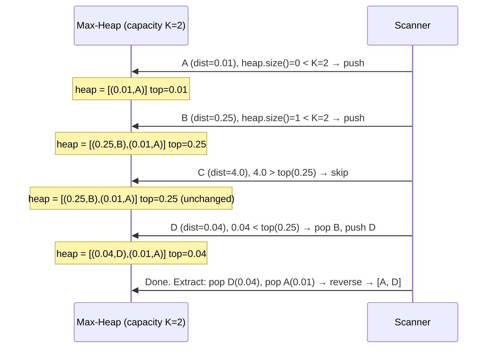
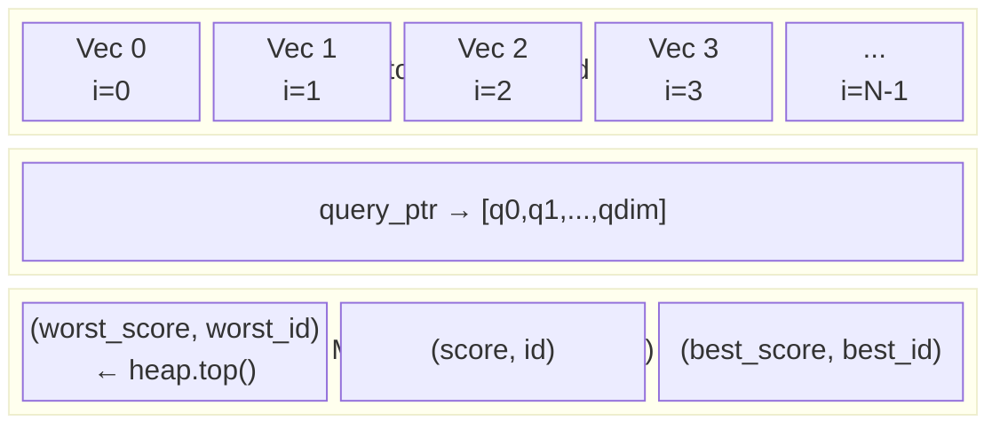
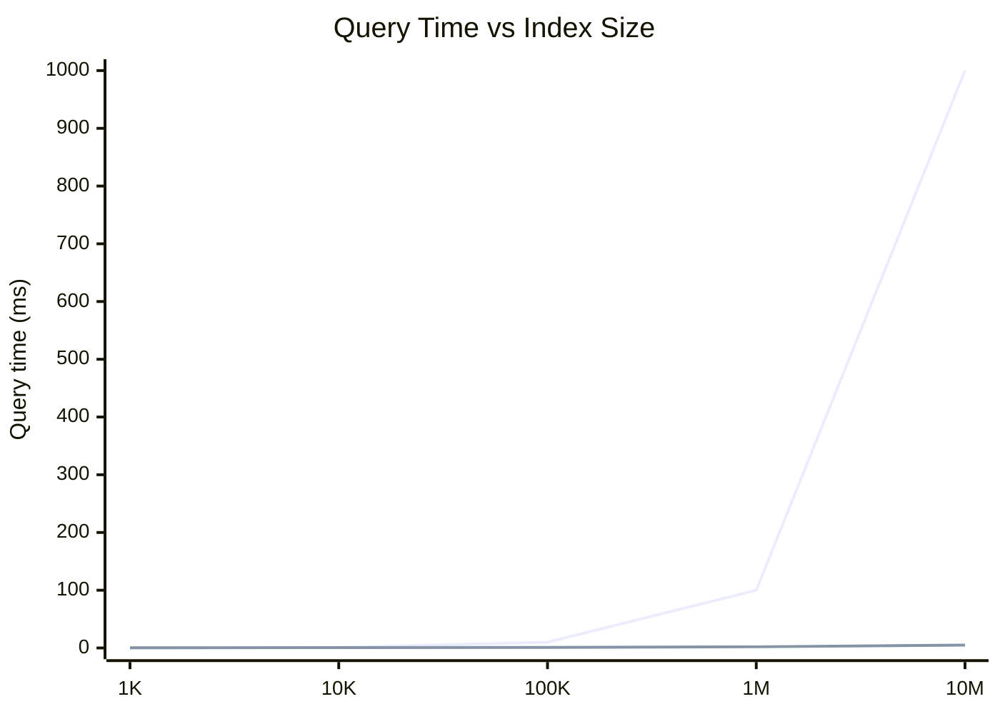

# Blog 4 — FlatIndex: Brute-Force Top-K Search with a Bounded Max-Heap

> **Series:** Building `fry-vector` — A Vector Database from Scratch in C++11
> **Level:** Intermediate
> **File:** `include/fry/flat_index.hpp`

---

## The Simplest Correct Search

Before we build the fast approximate search (HNSW, Phase 4), we need a search that is **guaranteed correct**. The `FlatIndex` computes the exact top-K nearest neighbours by comparing the query to **every single stored vector**.

This is O(N) per query. For N=1M vectors with dimension 128, that's 128 million multiply-adds per query. Sounds slow — but with SIMD (Blog 5) we can do this in milliseconds. And it gives us a ground truth to validate approximate methods against.

---

## The API

```cpp
template<Metric M>         // M baked in at compile time — zero-cost dispatch
class FlatIndex {
public:
    explicit FlatIndex(std::size_t dim);

    auto insert(const Vector<>& vec) -> Result<VectorId>;

    auto query(const Vector<float>& vec, std::size_t k) const
        -> Result<std::vector<VectorId>>;
};
```

`FlatIndex<Metric::L2>` and `FlatIndex<Metric::Cosine>` are different types at compile time. No runtime switch, no virtual dispatch.

---

## The Core Algorithm: Bounded Max-Heap

### The Problem

We want the **K smallest distances** out of N candidates. Sorting all N distances costs O(N log N). We can do better: O(N log K) with a bounded heap.

### Intuition: The "K Best So Far" Window

Think of the heap as a **sliding window of size K** containing your current best K candidates:

- The heap is a **max-heap**: the *worst* of your current best K is always at the top.
- For each new candidate, compare it against the worst in the heap.
- If the new candidate is **better** than the worst, evict the worst and insert the new one.
- If the new candidate is **worse**, skip it.

After scanning all N vectors, the heap contains exactly the K nearest.

### Step-by-Step Example

Query: `[1, 0]`
Stored vectors: A`[0.9, 0]`, B`[0.5, 0]`, C`[-1, 0]`, D`[0.8, 0]`
K = 2, Metric = L2

```
L2² distances from query:
  A: (1-0.9)² = 0.01   ← very close
  B: (1-0.5)² = 0.25
  C: (1-(-1))² = 4.0   ← far
  D: (1-0.8)² = 0.04   ← close
```



Result: `[A, D]` — the two nearest vectors, closest first. ✓

---

## The Code, Line by Line

```cpp
auto query(const Vector<float>& vec, std::size_t k) const
    -> Result<std::vector<VectorId>>
{
    // ── Guard conditions ──────────────────────────────────────────────────
    if (store_.size() == 0)
        return make_error<std::vector<VectorId>>(Error::store_empty());
    if (k == 0)
        return make_error<std::vector<VectorId>>(Error::invalid_argument("k must be > 0"));
    if (vec.dim() != dim())
        return make_error<std::vector<VectorId>>(
            Error::dimension_mismatch(vec.dim(), dim()));

    // ── Setup ─────────────────────────────────────────────────────────────
    const float*  slab      = store_.data();    // pointer to start of slab
    const float*  query_ptr = vec.data();       // pointer to query floats
    const size_t  dimension = store_.dim();
    const size_t  actual_k  = std::min(k, store_.size()); // can't return more than we have

    // Max-heap: pair<score, id>
    // top() = the worst match currently in our top-K window
    std::priority_queue<std::pair<float, VectorId>> heap;

    // ── Main scan loop ────────────────────────────────────────────────────
    for (VectorId i = 0; i < store_.size(); ++i) {
        const float* vec_i = slab + (i * dimension);  // pointer into the slab
        float dist     = dispatch<M>(query_ptr, vec_i, dimension);

        // The negation trick: cosine similarity is "higher = better",
        // but we want "lower = better" for the heap eviction logic.
        float heap_val = (M == Metric::Cosine) ? -dist : dist;

        if (heap.size() < actual_k) {
            heap.emplace(heap_val, i);          // heap not full yet — always insert
        } else if (heap_val < heap.top().first) {
            heap.pop();                         // evict worst
            heap.emplace(heap_val, i);          // insert better candidate
        }
        // else: this candidate is worse than all K we have — skip
    }

    // ── Extract results ───────────────────────────────────────────────────
    std::vector<VectorId> result;
    result.reserve(heap.size());
    while (!heap.empty()) {
        result.push_back(heap.top().second);
        heap.pop();
    }
    // Heap extracts worst-first. Reverse for closest-first output.
    std::reverse(result.begin(), result.end());

    return make_ok(result);
}
```

---

## Memory Layout During a Query



The pointer `slab + i * dimension` moves forward by exactly `dimension` floats with each iteration — perfectly sequential, cache-prefetcher-friendly. This is why the flat slab layout pays off.

---

## The Negation Trick, Explained Visually

For L2 and Inner Product, "smaller score = better match". For Cosine, "larger score = better match". We need the heap to always evict the **worst** match — which means we need a consistent notion of "worst".

```
Metric::L2 and InnerProduct:
  heap_val = dist          (0.01 = very close, 4.0 = far away)
  heap.top() = largest value = farthest = worst → evict when we find something smaller ✓

Metric::Cosine:
  dist = 0.95  (very similar)  →  heap_val = -0.95
  dist = 0.10  (dissimilar)    →  heap_val = -0.10
  heap.top() = largest value = -0.10 = least similar = worst → evict when we find -0.95 ✓
```

After extraction, negate again if you need the actual similarity scores (we only return IDs, so this isn't needed here).

---

## Why a Max-Heap and Not a Min-Heap?

This confuses many people. Think of it this way:

> "I always want to know who the **worst** person in my current top-K is, so I know whether to kick them out for the next candidate."

A **max-heap** gives you the worst (largest distance) at the top in O(1). A min-heap would give you the best at the top — useless for the eviction decision. The min-heap is only needed at the very end when sorting final results (which we achieve with `std::reverse` instead).

---

## Complexity and Correctness Guarantees

| Property | Value |
|---|---|
| Time complexity | O(N log K) per query |
| Space complexity | O(K) heap |
| Correctness | 100% exact — every vector compared |
| Result ordering | Closest first |
| Maximum K | Clamped to `store_.size()` |

---

## Bugs We Found and Fixed

**Bug 1: Cosine first branch using `dist` instead of `heap_val`**

An early version had:
```cpp
if (heap.size() < actual_k) {
    heap.emplace(dist, i);        // BUG: should be heap_val
```
This caused cosine search to use un-negated similarity values for the fill phase but negated values for the eviction phase — the heap had mixed conventions and produced wrong results.

**Fix:** Both branches must use `heap_val` consistently.

**Bug 2: Cosine denominator `+` instead of `*`**

```cpp
// BUG
float norm_product = norm(a, dim) + norm(b, dim);

// FIX
float norm_product = norm(a, dim) * norm(b, dim);
```

Addition gives a meaningless denominator. The test `55 - FlatIndex<Cosine>: nearest by angle not distance` caught this.

---

## What's Next: From Exact to Approximate

`FlatIndex` is correct but O(N). For 10M vectors at 768 dimensions, even with SIMD this takes seconds per query. The next index — HNSW — sacrifices a tiny bit of accuracy for logarithmic search time.



*Top line: FlatIndex (O(N)). Bottom line: HNSW (O(log N), Phase 4).*

---

[**← Blog 3**](./03-distance-metrics.md) · [**Blog 5 →**](./05-simd.md)

*Built with C++11 · CMake · Catch2 · clang-tidy · ASan*
