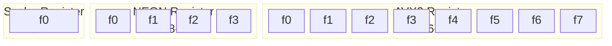
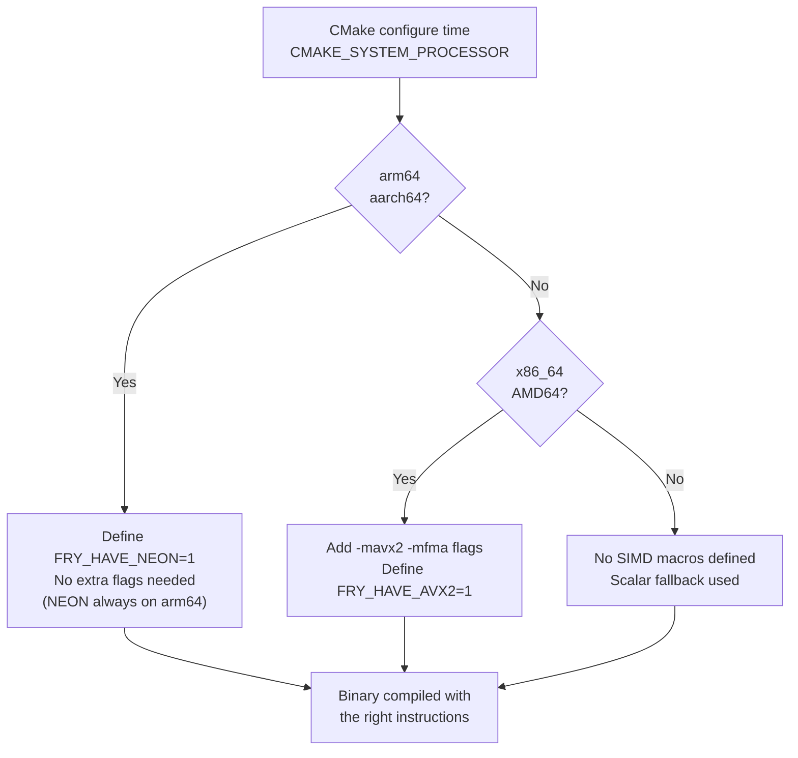
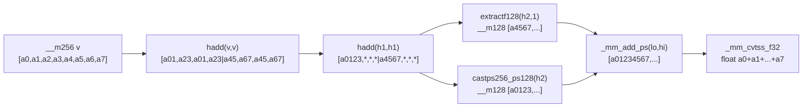
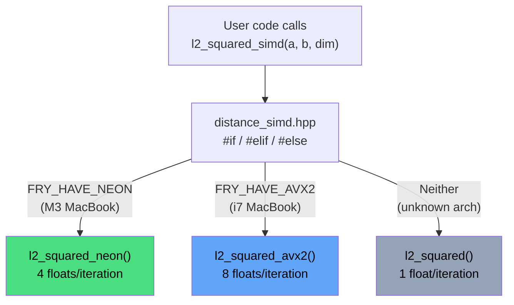

# Blog 5 — SIMD: Supercharging Distance Computation with NEON and AVX2

> **Series:** Building `fry-vector` — A Vector Database from Scratch in C++11
> **Level:** Advanced
> **Files:** `include/fry/distance_neon.hpp`, `include/fry/distance_avx2.hpp`, `include/fry/distance_simd.hpp`, `CMakeLists.txt`

---

## The Bottleneck

The flat index from Blog 4 is correct, but every query calls the distance function N×dim times. With N=1M vectors and dim=128, that's **128 million multiply-add operations per query**. The scalar implementation does one float at a time:

```cpp
for (std::size_t i = 0; i < dim; ++i)
    squared += (a[i] - b[i]) * (a[i] - b[i]);  // 1 float/iteration
```

Modern CPUs can do 4 to 8 floats simultaneously. If we're doing 1 at a time, we're leaving 75–87% of the CPU's compute capacity unused.

**SIMD** — Single Instruction, Multiple Data — fixes this.

---

## What Is SIMD?

A SIMD instruction operates on **a vector register** — a wide register holding multiple values — in a single clock cycle. Instead of adding two floats, you add 4 or 8 float pairs simultaneously.

```
Scalar (1 float/operation):
  a[0]-b[0] = d0        (1 subtraction)
  a[1]-b[1] = d1        (1 subtraction)
  a[2]-b[2] = d2        (1 subtraction)
  a[3]-b[3] = d3        (1 subtraction)
  4 instructions total

NEON (4 floats/operation):
  [a0,a1,a2,a3] - [b0,b1,b2,b3] = [d0,d1,d2,d3]   (1 instruction)
  1 instruction total — 4× throughput
```



---

## Two Architectures, Two SIMD Extensions

`fry-vector` runs on two different CPU architectures, each with its own SIMD instruction set:

| Feature | ARM NEON (M3 MacBook) | x86 AVX2 (i7 MacBook) |
|---|---|---|
| Register width | 128-bit | 256-bit |
| Floats/register | 4 | 8 |
| Header | `<arm_neon.h>` | `<immintrin.h>` |
| Compile flag | built-in on arm64 | `-mavx2 -mfma` |
| CMake macro | `FRY_HAVE_NEON` | `FRY_HAVE_AVX2` |
| Horizontal sum | `vaddvq_f32` (1 op) | 5-step `hadd`/extract/add |

---

## CMake: Compile-Time Architecture Detection

The build system detects the CPU and defines the right macro. No runtime detection — the correct code path is **baked into the binary**:

```cmake
add_library(fry_simd INTERFACE)

if(CMAKE_SYSTEM_PROCESSOR MATCHES "arm64|aarch64")
    message(STATUS "fry-vector: ARM64 detected — NEON enabled")
    target_compile_definitions(fry_simd INTERFACE FRY_HAVE_NEON=1)

elseif(CMAKE_SYSTEM_PROCESSOR MATCHES "x86_64|AMD64")
    message(STATUS "fry-vector: x86_64 detected — enabling AVX2 + FMA")
    target_compile_options(fry_simd INTERFACE -mavx2 -mfma)
    target_compile_definitions(fry_simd INTERFACE FRY_HAVE_AVX2=1)

else()
    message(STATUS "fry-vector: Unknown architecture — SIMD disabled, scalar only")
endif()
```



---

## ARM NEON: The M3 Implementation

### Key Intrinsics

```
float32x4_t              — 128-bit register: [lane0, lane1, lane2, lane3]

vdupq_n_f32(x)           — broadcast: [x, x, x, x]
vld1q_f32(ptr)           — load 4 floats: [ptr[0], ptr[1], ptr[2], ptr[3]]
vsubq_f32(a, b)          — subtract: [a0-b0, a1-b1, a2-b2, a3-b3]
vfmaq_f32(acc, a, b)     — fused multiply-add: acc[i] += a[i] * b[i]
vaddvq_f32(v)            — horizontal sum: v[0]+v[1]+v[2]+v[3] → scalar
```

### L2 Squared NEON

```cpp
inline auto l2_squared_neon(const float* a, const float* b, std::size_t dim) -> float {
    float32x4_t acc = vdupq_n_f32(0.0f);  // accumulator: [0, 0, 0, 0]
    std::size_t i = 0;

    for (; i + 4 <= dim; i += 4) {
        float32x4_t va   = vld1q_f32(a + i);  // load 4 floats from a
        float32x4_t vb   = vld1q_f32(b + i);  // load 4 floats from b
        float32x4_t diff = vsubq_f32(va, vb); // diff[k] = a[k] - b[k]
        acc = vfmaq_f32(acc, diff, diff);      // acc[k] += diff[k]²
    }

    float result = vaddvq_f32(acc);  // sum all 4 lanes → scalar

    for (; i < dim; ++i) {           // scalar tail for dim % 4 remainder
        const float d = a[i] - b[i];
        result += d * d;
    }
    return result;
}
```

The loop processes 4 floats per iteration. For dim=128: 32 NEON iterations instead of 128 scalar iterations — **4× fewer iterations**.

### Loop Structure Visualised

```
dim = 10, with 4-wide NEON:

Iteration 0 (i=0):  [a0, a1, a2, a3] - [b0, b1, b2, b3]  → 4 diffs → acc
Iteration 1 (i=4):  [a4, a5, a6, a7] - [b4, b5, b6, b7]  → 4 diffs → acc
Scalar tail (i=8):  a8 - b8  → result
                    a9 - b9  → result
                    (i=10 → stop)
```

---

## x86 AVX2: The i7 Implementation

AVX2 registers are 256-bit — they hold 8 floats instead of 4. But the horizontal sum (collapsing 8 lanes to 1 scalar) is much harder than NEON's `vaddvq_f32`.

### The 5-Step Horizontal Sum

```
Input: __m256 v = [a0, a1, a2, a3, a4, a5, a6, a7]

Step 1: _mm256_hadd_ps(v, v)
  Horizontal add within each 128-bit half independently:
  result: [a0+a1, a2+a3, a0+a1, a2+a3 | a4+a5, a6+a7, a4+a5, a6+a7]
  (each 128-bit half is self-contained — hadd doesn't cross the boundary)

Step 2: _mm256_hadd_ps(h1, h1)
  result: [a0+a1+a2+a3, *, *, * | a4+a5+a6+a7, *, *, *]

Step 3: _mm256_extractf128_ps(h2, 1)
  Extract HIGH 128-bit half as __m128:
  result: [a4+a5+a6+a7, ...]

Step 4: _mm_add_ps(lo128, hi128)
  Add low half (a0..a3 sum) + high half (a4..a7 sum):
  lane[0] = a0+a1+a2+a3+a4+a5+a6+a7

Step 5: _mm_cvtss_f32(sum)
  Extract lane[0] as scalar float.
```



### L2 Squared AVX2

```cpp
inline auto l2_squared_avx2(const float* a, const float* b, std::size_t dim) -> float {
    __m256 acc = _mm256_setzero_ps();  // [0,0,0,0,0,0,0,0]
    std::size_t i = 0;

    for (; i + 8 <= dim; i += 8) {
        __m256 va   = _mm256_loadu_ps(a + i);  // load 8 floats from a
        __m256 vb   = _mm256_loadu_ps(b + i);  // load 8 floats from b
        __m256 diff = _mm256_sub_ps(va, vb);   // diff[k] = a[k] - b[k]
        acc = _mm256_fmadd_ps(diff, diff, acc); // acc[k] += diff[k]²
    }

    float result = hsum256(acc);  // 5-step horizontal reduction

    for (; i < dim; ++i) {        // scalar tail for dim % 8 remainder
        const float d = a[i] - b[i];
        result += d * d;
    }
    return result;
}
```

For dim=128: 16 AVX2 iterations instead of 128 scalar — **8× fewer iterations**.

---

## The Unified Dispatcher

`distance_simd.hpp` is the single header all user code includes. It selects the right backend at compile time with no runtime overhead:

```cpp
// distance_simd.hpp
#include "distance.hpp"        // scalar fallback

#if defined(FRY_HAVE_NEON)
#   include "distance_neon.hpp"
#elif defined(FRY_HAVE_AVX2)
#   include "distance_avx2.hpp"
#endif

namespace fry {

inline auto l2_squared_simd(const float* a, const float* b, std::size_t dim) -> float {
#if defined(FRY_HAVE_NEON)
    return l2_squared_neon(a, b, dim);
#elif defined(FRY_HAVE_AVX2)
    return l2_squared_avx2(a, b, dim);
#else
    return l2_squared(a, b, dim);  // scalar fallback
#endif
}

} // namespace fry
```



Zero runtime cost — the `#if` chain is resolved at compile time. The resulting binary contains only the branch that was selected.

---

## FMA: Fused Multiply-Add

Both NEON's `vfmaq_f32` and AVX2's `_mm256_fmadd_ps` are **fused** operations. "Fused" means the multiply and add happen in a single hardware step, with a **single rounding** instead of two:

```
Non-fused:              acc = acc + (diff * diff)
                        Step 1: tmp = diff * diff   ← round to float
                        Step 2: acc = acc + tmp      ← round to float
                        2 rounding errors

Fused (FMA):            acc = fma(diff, diff, acc)
                        One operation, one rounding
                        More accurate result
```

FMA also has higher throughput on many CPUs — one pipeline stage instead of two. Both accuracy and speed improve.

---

## The Scalar Tail: Handling Irregular Dimensions

What if `dim = 13`? NEON processes 4 at a time, so:

```
Main loop: i = 0 → 4 → 8 → (8+4=12 > 13? No → i=8+4=12 is fine, 12+4=16 > 13 → stop)

Wait — let's re-check. Loop condition: i + 4 <= dim (i + 4 <= 13)
  i=0:  0+4=4  ≤ 13  → process [0,1,2,3]
  i=4:  4+4=8  ≤ 13  → process [4,5,6,7]
  i=8:  8+4=12 ≤ 13  → process [8,9,10,11]
  i=12: 12+4=16 > 13 → stop

Scalar tail: i=12 to i<13 → process [12]
```

One element handled by the scalar tail. The output is identical to the scalar implementation.

---

## Clang-Tidy: NOLINTBEGIN/END

Clang-Tidy's `bugprone-easily-swappable-parameters` rule warns when two adjacent parameters have the same type — in our case, `const float* a, const float* b`. Swapping them accidentally would compute the wrong distance.

The warning is valid in general, but SIMD kernels are internal functions called only through the dispatcher. We suppress it with lexical brackets:

```cpp
// NOLINTBEGIN(bugprone-easily-swappable-parameters)
namespace fry {
    inline auto l2_squared_neon(const float* a, const float* b, std::size_t dim) -> float;
    inline auto inner_product_neon(const float* a, const float* b, std::size_t dim) -> float;
}
// NOLINTEND(bugprone-easily-swappable-parameters)
```

The `BEGIN/END` form is preferred over per-line `// NOLINT` because it covers the entire scope and is self-documenting.

---

## Expected Performance Gains

| Scenario | Scalar | NEON (4×) | AVX2 (8×) |
|---|---|---|---|
| dim=128, 1 pair | ~128 ns | ~32 ns | ~16 ns |
| 1M vectors query | ~128 ms | ~32 ms | ~16 ms |
| Theoretical peak | 1× | 4× | 8× |

*Real-world gains are typically 2–6× due to memory bandwidth limits, not pure compute.*

---

## Summary

| Component | Platform | Floats/iter | Key intrinsics |
|---|---|---|---|
| `distance_neon.hpp` | ARM64 (M-series) | 4 | `vld1q_f32`, `vfmaq_f32`, `vaddvq_f32` |
| `distance_avx2.hpp` | x86_64 (Intel/AMD) | 8 | `_mm256_loadu_ps`, `_mm256_fmadd_ps`, `hsum256` |
| `distance_simd.hpp` | All platforms | best available | compile-time `#if` dispatch |
| `distance.hpp` | All platforms | 1 | scalar fallback, always available |

SIMD is the first major performance optimization in `fry-vector`. The next — HNSW (Phase 4) — reduces the number of distance computations from O(N) to O(log N), which is an even larger win.

---

[**← Blog 4**](./04-flat-index.md)

*Next: Blog 6 — HNSW: Approximate Nearest Neighbour Search in O(log N)* *(coming in Phase 4)*

*Built with C++11 · CMake · Catch2 · clang-tidy · ASan*
