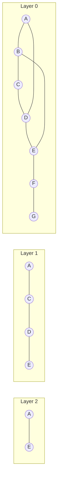
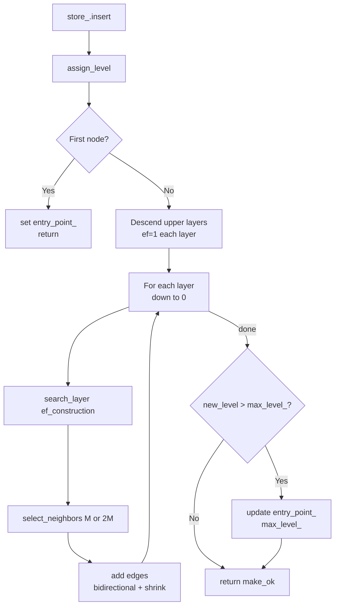

# HNSW Implementation Guide

Reference: [Malkov & Yashunin, 2018](https://arxiv.org/abs/1603.09320)
Files: `include/fry/hnsw_index.hpp`, `src/hnsw_index.cpp`, `tests/test_hnsw.cpp`

Implement the methods in `hnsw_index.cpp` in the order listed below. Each one builds on the previous.

---

## The Big Picture

HNSW is a layered graph. Every node lives in layer 0. Each higher layer holds a random subset — fewer nodes, longer jumps. A query starts at the top (fast skip to the right neighbourhood) and drills down to layer 0 (precise result).



Search enters at the top layer, greedily moves toward the query, then hands off the best candidate to the next lower layer.

---

## Data Structures

### HNSWNode

```
nodes_[id].neighbors[layer] = [ id1, id2, id3, ... ]
```

`neighbors` is a jagged 2D vector. A node inserted at level `l` gets `l+1` inner vectors (one per layer). Layer 0 allows `2*M` neighbours; layers 1+ allow `M`.

### Key members in HNSWIndex

| Member | Type | Meaning |
|---|---|---|
| `store_` | `VectorStore` | flat float slab, same as FlatIndex |
| `nodes_` | `vector<HNSWNode>` | `nodes_[id]` holds the graph edges for vector `id` |
| `M_` | `size_t` | max neighbours per node per layer |
| `ef_construction_` | `size_t` | beam width when building the graph |
| `mL_` | `double` | `1.0 / log(M_)` — controls level distribution |
| `entry_point_` | `VectorId` | the top-level node we start every search from |
| `max_level_` | `int` | highest layer currently in the graph |
| `rng_` | `mt19937` | seeded once at construction |

---

## Method 1 — `node_dist`

The building block used everywhere else. Gets the float pointer for node `id` from the slab and calls the metric.

```
Vector id lives at:  store_.data() + id * store_.dim()
```

```cpp
return dispatch<M>(query, store_.data() + id * store_.dim(), store_.dim());
```

That's the entire implementation.

---

## Method 2 — `assign_level`

Samples how many layers a new node participates in.

```
level = floor( -ln( U(0,1) ) * mL_ )
```

```cpp
std::uniform_real_distribution<double> dist(0.0, 1.0);
return static_cast<int>(std::floor(-std::log(dist(rng_)) * mL_));
```

With `M=16`, roughly 94% of nodes get level 0, ~6% get level 1, ~0.4% get level 2.

---

## Method 3 — `select_neighbors`

Given a max-heap of candidates, pick the closest `num_neighbors`.

The heap gives worst first when you pop. Drain everything into a vector, then take the tail — those are the closest.

```
all = drain heap into vector       → [worst, ..., best]
take = min(num_neighbors, all.size())
return ids of all[size-take .. size-1]
```

```cpp
std::vector<std::pair<float, VectorId>> all;
while (!candidates.empty()) { all.push_back(candidates.top()); candidates.pop(); }
std::size_t take = std::min(num_neighbors, all.size());
std::vector<VectorId> result;
for (std::size_t i = all.size() - take; i < all.size(); ++i)
    result.push_back(all[i].second);
return result;
```

---

## Method 4 — `search_layer`

The core search kernel. Algorithm 2 from the paper.

Explores the graph at a single layer, starting from `entry_points`, and returns the `ef` nearest nodes it finds.

### Data structures

```
found      — max-heap<(dist, id)>         bounded to ef; worst at top
candidates — min-heap<(dist, id)>         best unexplored node at top
visited    — unordered_set<VectorId>      skip nodes already seen
```

Both heaps start seeded with `entry_points`. `visited` starts with those same IDs.

### Loop

```
while candidates not empty:
    c = pop best from candidates          (closest unexplored)
    if c.dist > found.top().dist AND found is full:
        break                             (nothing left can improve found)

    for each neighbour nb of c at this layer:
        if nb not in visited:
            visited.insert(nb)
            d = node_dist(nb, query)
            if d < found.top().dist OR found not full:
                candidates.push({d, nb})
                found.push({d, nb})
                if found.size() > ef: found.pop()   // evict worst

return found
```

### C++11 min-heap declaration

```cpp
using MinHeap = std::priority_queue<
    std::pair<float, VectorId>,
    std::vector<std::pair<float, VectorId>>,
    std::greater<std::pair<float, VectorId>>>;
MinHeap candidates;
```

No structured bindings in C++11 — use `.first` / `.second`.

Before accessing `nodes_[c_id].neighbors[layer]`, guard with:
```cpp
if (static_cast<int>(nodes_[c_id].neighbors.size()) > layer)
```

---

## Method 5 — `insert`

Algorithm 1 from the paper. Orchestrates everything above.



### Step by step

**A. Dimension guard** — return `DimensionMismatch` if `vec.dim() != dim()`.

**B. Store** — `auto id_result = store_.insert(vec);`. Propagate error if it fails. Get `VectorId new_id = *id_result`.

**C. Level** — `int new_level = assign_level();`

**D. Create node** — `nodes_.emplace_back(new_level);`
This gives `nodes_[new_id].neighbors` a jagged vector of size `new_level + 1`.

**E. First node** — if `entry_point_ == kInvalidId`, set it and `max_level_`, return.

**F. Descend upper layers** (from `max_level_` down to `new_level + 1`, ef=1 each)

```cpp
std::vector<std::pair<float, VectorId>> ep = {
    { node_dist(entry_point_, vec.data()), entry_point_ }
};
for (int lc = max_level_; lc > new_level; --lc) {
    auto res = search_layer(ep, vec.data(), 1, lc);
    ep = { res.top() };
}
```

**G. Build edges** (from `min(new_level, max_level_)` down to 0)

```cpp
for (int lc = std::min(new_level, max_level_); lc >= 0; --lc) {
    auto W   = search_layer(ep, vec.data(), ef_construction_, lc);
    std::size_t M_lc = (lc == 0) ? 2 * M_ : M_;
    auto nbs = select_neighbors(W, M_lc);

    nodes_[new_id].neighbors[lc] = nbs;

    for (VectorId nb : nbs) {
        nodes_[nb].neighbors[lc].push_back(new_id);
        if (nodes_[nb].neighbors[lc].size() > M_lc) {
            // rebuild candidate heap from nb's current links, then shrink
            std::priority_queue<std::pair<float, VectorId>> nb_cands;
            for (VectorId e : nodes_[nb].neighbors[lc])
                nb_cands.emplace(node_dist(e, store_.data() + nb * store_.dim()), e);
            nodes_[nb].neighbors[lc] = select_neighbors(nb_cands, M_lc);
        }
    }

    // use the picked neighbours as entry points for the next layer
    ep.clear();
    for (VectorId nb : nbs)
        ep.emplace_back(node_dist(nb, vec.data()), nb);
}
```

**H. Update entry point** — if `new_level > max_level_`, update both.

**I. Return** — `return make_ok(new_id);`

---

## Method 6 — `query`

Algorithm 5 from the paper. Read-only — no graph modification.

**A. Guards**
```cpp
if (store_.size() == 0)   return make_error ... StoreEmpty
if (k == 0)               return make_error ... InvalidArgument
if (vec.dim() != dim())   return make_error ... DimensionMismatch
std::size_t actual_k  = std::min(k, store_.size());
std::size_t actual_ef = std::max(ef_search, actual_k); // ef must be >= k
```

**B–C. Descend to layer 1** — same as insert step F, but go down to layer 1 (not layer 0).

```cpp
std::vector<std::pair<float, VectorId>> ep = {
    { node_dist(entry_point_, vec.data()), entry_point_ }
};
for (int lc = max_level_; lc > 0; --lc) {
    auto res = search_layer(ep, vec.data(), 1, lc);
    ep = { res.top() };
}
```

**D. Layer 0 beam search**
```cpp
auto candidates = search_layer(ep, vec.data(), actual_ef, 0);
```

**E. Extract top-K**
```cpp
std::vector<VectorId> result;
while (!candidates.empty() && result.size() < actual_k) {
    result.push_back(candidates.top().second);
    candidates.pop();
}
std::reverse(result.begin(), result.end()); // max-heap gave worst-first
return make_ok(result);
```

---

## Suggested Test Order

Run tests one at a time as you implement. This lets you catch problems early.

| After implementing | Expected passing tests |
|---|---|
| Constructor + `node_dist` + `assign_level` | Construction tests (size/dim) |
| `select_neighbors` | Compiles; no runtime tests yet |
| `search_layer` | Still fails — needs insert first |
| `insert` (step E only — first node) | Insert one vector, query it back |
| `insert` (full) | Nearest of two, top-2, k clamping, metric tests |
| `query` | All tests including recall |

The recall tests are the final quality gate. If `recall@1 == 1.0` on 50 vectors with `ef_search = N` passes, the algorithm is correct.

---

## Common Mistakes

**Wrong heap type** — `search_layer` returns a max-heap (`found`). Don't accidentally return the min-heap (`candidates`).

**Forgetting to reverse** — the max-heap gives you worst-first. `query` must `std::reverse` before returning.

**Layer bounds** — only access `nodes_[id].neighbors[layer]` if the node actually participates in that layer. A node at level 0 has `neighbors.size() == 1`, so `neighbors[1]` is out of bounds.

**Entry point on first insert** — don't run `search_layer` when the index is empty. Handle the first-node case before the descent loop.

**ef < k** — `actual_ef = max(ef_search, actual_k)` ensures we never try to return more results than we searched for.
